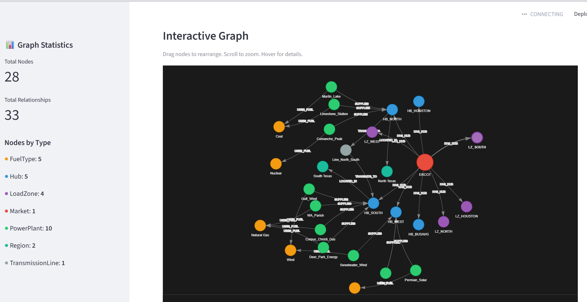
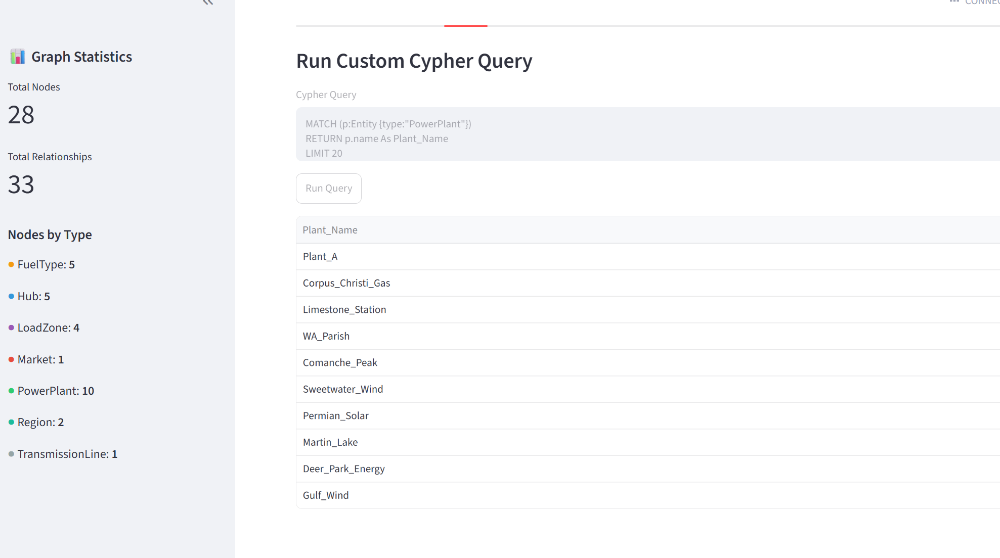

# Energy Knowledge Graph

A Python library for building and querying knowledge graphs focused on energy market data. Built with NetworkX for learning and Neo4j for production.

## Screenshots

### Interactive Graph Visualization


### Custom Cypher Queries


## Features

- Create entities with types (Markets, Hubs, Regions, PowerPlants, FuelTypes)
- Define relationships between entities (HAS_HUB, SUPPLIES, USES_FUEL, LOCATED_IN)
- Query related entities by relationship type
- Traverse multi-hop paths through the graph
- Filter entities by type and properties
- **Two backends**: In-memory (NetworkX) and persistent (Neo4j)
- **Interactive dashboard** for visualization and analytics

## Installation

Requires Python 3.12+

```bash
uv sync
```

## Quick Start

### Option 1: In-Memory Graph (NetworkX)

```python
from src.energy_kg.graph import EnergyKnowledgeGraph

kg = EnergyKnowledgeGraph()

# Add entities
kg.add_entity("ERCOT", "Market")
kg.add_entity("HB_SOUTH", "Hub")
kg.add_entity("South Texas", "Region")

# Add relationships
kg.add_relationship("ERCOT", "HB_SOUTH", "HAS_HUB")
kg.add_relationship("HB_SOUTH", "South Texas", "LOCATED_IN")

# Query
hubs = kg.get_related_entities("ERCOT", "HAS_HUB")
regions = kg.traverse("ERCOT", ["HAS_HUB", "LOCATED_IN"])
```

### Option 2: Persistent Graph (Neo4j)

```bash
# Start Neo4j
docker run -d --name neo4j -p 7474:7474 -p 7687:7687 -e NEO4J_AUTH=none neo4j:latest
```

```python
from src.energy_kg.neo4j_graph import Neo4jKnowledgeGraph

kg = Neo4jKnowledgeGraph(uri="bolt://localhost:7687")

# Same API as NetworkX version
kg.add_entity("ERCOT", "Market", country="USA")
kg.add_entity("HB_SOUTH", "Hub", zone="South")
kg.add_relationship("ERCOT", "HB_SOUTH", "HAS_HUB")

# Query
hubs = kg.get_related_entities("ERCOT", "HAS_HUB")

kg.close()
```

## Load Sample Data

```bash
uv run python load_data.py
```

This loads ERCOT power plants, hubs, and load zones from CSV files.

## Visualization Dashboard

```bash
uv run streamlit run dashboard.py
```

Open http://localhost:8501 for:
- **Graph View**: Interactive network visualization
- **Analytics**: Capacity by fuel type, renewable energy mix
- **Query**: Run custom Cypher queries

## Neo4j Browser

Access http://localhost:7474 for the native Neo4j visualization. Try:

```cypher
-- View entire graph
MATCH (n)-[r]->(m) RETURN n, r, m

-- Find power plants by fuel
MATCH (p:Entity {type: 'PowerPlant'})-[:USES_FUEL]->(f)
RETURN p.name, f.name

-- Total capacity by fuel type
MATCH (p:Entity {type: 'PowerPlant'})-[:USES_FUEL]->(f)
RETURN f.name, sum(p.capacity_mw) AS capacity
ORDER BY capacity DESC
```

## Project Structure

```
energy-knowledge-graph/
├── src/energy_kg/
│   ├── graph.py          # NetworkX backend
│   └── neo4j_graph.py    # Neo4j backend
├── data/
│   ├── power_plants.csv  # Sample power plant data
│   └── hubs.csv          # Sample hub/zone data
├── main.py               # NetworkX example
├── main_neo4j.py         # Neo4j example
├── load_data.py          # CSV data loader
├── dashboard.py          # Streamlit visualization
└── README.md
```

## Entity Types

| Type | Description | Example |
|------|-------------|---------|
| Market | Power market/ISO | ERCOT, PJM |
| Hub | Pricing/trading point | HB_SOUTH, HB_NORTH |
| LoadZone | Demand area | LZ_SOUTH, LZ_WEST |
| Region | Geographic area | South Texas |
| PowerPlant | Generation facility | Wind_Farm_West |
| FuelType | Energy source | Natural Gas, Solar |

## Relationships

| Relationship | From → To | Meaning |
|--------------|-----------|---------|
| HAS_HUB | Market → Hub | Market contains hub |
| LOCATED_IN | Hub → Region | Hub location |
| SUPPLIES | PowerPlant → Hub | Plant feeds hub |
| USES_FUEL | PowerPlant → FuelType | Plant's fuel source |

## Dependencies

- networkx >= 3.6.1
- neo4j >= 5.0.0
- streamlit >= 1.0.0
- pyvis >= 0.3.0
